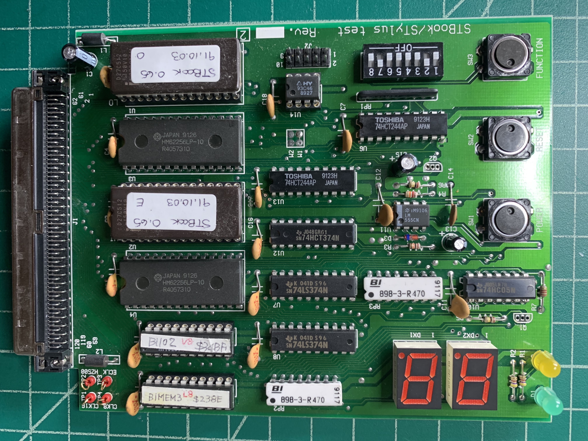
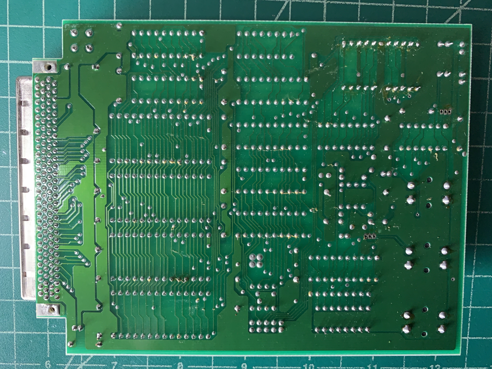

# Atari STBook/STylus Diagnostic Board

## Usage

Turn the computer off and connect the diagnostic board to the computer – it only requires the main board to run – no devices need or should be connected. By default DIP 2 and DIP 7 should be `ON`, all other should be `OFF`. Then power the computer back on by pressing the `POWER` button. It will immediately start executing the diagnostic tests, which can be monitored by looking at the LED display and the yellow LED blinking. Most tests are really fast, some take many seconds. A complete test should take less than 2 minutes.

`00` Diagnostic start

- setup exception vectors
- turn yellow LED on
- set video buffer to $10000, black on white, clear video buffer
- test for function button – if pressed, then display version of diagnostic ROM

`01` CPU Test
- test bset and asl with all data registers
- on failure display `0.1` and wait forever in a loop.

`02` Short delay

`03` Voltage test

- test “Common Source” voltage level below 7.2V /(SOURCE\_DEAD)
- on failure display `b.3`, wait for function key
- test "Common Source” voltage level below 8.8V /(SOURCE\_LOW)
- on failure display `b.1`, wait for function key
- read power voltage to be in the range of 6.4V and 22.4V
- on failure display with delays between them:
	- `0.3`
	- '  '
	- `01`
	- `= `
	- '  '
	- hex-value of the power voltage
	- '  '
- read reference voltage to be in the range of 6.4V and 22.4V
- on failure display with delays between them:
	- `0.3`
	- '  '
	- `02`
	- `= `
	- '  '
	- hex-value of the reference voltage
	- '  '
	- wait for function button

`04` Sound test

- test sound channel A (if enabled via DIP 3)

`08` Diagnostic ROM CRC

- on failure display with delays between them:
	- `0.8`
	- `= `
	- '  '
	- hex-expected-highbyte
	- '  '
	- hex-expected-lowbyte
	- `||`
	- '  '
	- hex-actual-highbyte
	- '  '
	- hex-actual-lowbyte
	- '  '
	- wait for function button

`09` Diagnostic SRAM test

- write $FFFF,$55AA,$AA55 and $0000 into the RAM and test the result.
- on failure display `0.9` and wait forever in a loop

`0A` Diagnostic LED test

- test diagnostic U12/U13
- on failure display with delays between them:
	- `0.A`
	- '= '
	- '  '
	- hex-expected-value
	- '  '
	- `||`
	- '  '
	- hex-actual-value
	- '  '
	- wait for function button

`0B` Short delay

`10` ROM CRC

- on failure display with delays between them:
	- `1.0`
	- `= `
	- '  '
	- hex-expected-highbyte
	- '  '
	- hex-expected-lowbyte
	- '  '
	- `||`
	- '  '
	- hex-actual-highbyte
	- '  '
	- hex-actual-lowbyte
	- '  '
	- wait for function button

`12` First 2kb RAM

- write $FFFF,$55AA,$AA55 and $0000 into the RAM and test the result.
- on failure display `1.2` and wait for function button

`18` MFP Register

- test MFP AER and VR register
- on failure display `1.8` and wait for function button

`19` Shifter Register

- test shifter video base high, mid and low and scanline width register
- on failure display `1.9` and wait for function button

`1A` Short delay

`1b` DMA Register

- test dma ptr high, mid and low register
- on failure display `1.b` and do further tests while waiting for the function button

`1c` Short delay

`1d` Blitter Register

- on failure display with delays between them:
	- `1.d`
	- `= `
	- '  '
	- hex-expected-highbyte
	- '  '
	- hex-expected-lowbyte
	- '  '
	- `||`
	- '  '
	- hex-actual-highbyte
	- '  '
	- hex-actual-lowbyte
	- '  '
	- wait for function button
	- wait for function button

`1E` IDE Register

- access several IDE register

`20` MFP UART

- setup serial port 9600 8N1, wait 10ms
- send one byte ('A') and test that after 2ms the Tx buffer is empty
- send one byte ('B') and test that after 2ms the Tx buffer is empty
- on failure display `2.0` and wait for function button

`21` Short delay

`28` ACIA MIDI

- setup MIDI serial port, wait 20ms
- send one byte ($00) and test that after 2ms the Tx buffer is empty
- send one byte ($01) and test that after 2ms the Tx buffer is empty
- on failure display `2.8` and wait for function button

`29` ACIA IKBD

- setup IKBD communication, wait 20ms

`30` Send IKBD reset command

- send the reset command ($80 followed by $01), expect a boot reply message within 200ms
- on failure display
	- `3.0`
	- '  '
	- hex-reply of the IKBD
	- '  '
	- wait for function button
  or, if no reply was received:
	- `3.0`
	- '  '
	- 'ff
	- '  '
	- 'ff
	- '  '
	- wait for function button

`31` Short delay

`40` Short delay

`41` 1MB RAM test power-of-2

- write $0000 and $FFFF in RAM locations and test for result. Test in power-of-2 steps up to 1MB
- on failure display
	- `4.1`
	- '  '
	- hex-addr-high
	- '  '
	- hex-addr-midhigh
	- '  '
	- hex-addr-midlow
	- '  '
	- hex-addr-low
	- '  '
	- wait for function button

`42` Test 2kb-1MB RAM with test patterns

- write $FFFF,$55AA,$AA55,$0000 in RAM locations and test for result.
- on failure display `4.2` and wait for function button

`44` Test 2kb-1MB RAM with values

- write 16-bit values (0,3,6,9,etc) into all memory
- wait 5s
- read 16-bit values (0,3,6,9,etc) from memory and compare with expected result
- on failure display `4.4` and wait for function button

`45` Test memory with VRAM setup

- fill video ram with test pattern ($5AA55AA5)
- write $FFFF,$55AA,$AA55,$0000 in all RAM locations behind the VRAM and test for result.
- on failure display `4.5` and wait for function button

`46` Test memory with VRAM setup

- fill video ram with test pattern ($FFFFFFFF)
- write $FFFF,$55AA,$AA55,$0000 in all RAM locations behind the VRAM and test for result.
- on failure display `4.6` and wait for function button

`47` Enable refresh controller

- write $10 into $FF827F
- wait 100ms

`48` Repeat RAM Test `44`

- write $FFFF,$55AA,$AA55,$0000 in all RAM locations and test for result.
- on failure display `4.8` and wait for function button

`49` Enable shadow controller video transfer

- write $01 into $FF820A
- wait 100ms

`4A` Repeat RAM Test `45`

- write 16-bit values (0,3,6,9,etc) into all memory
- wait 4s
- rest 16-bit values (0,3,6,9,etc) from memory and compare with expected result
- on failure display `4.A` and wait for function button

`4b` Disable shadow controller video transfer

- write $00 into $FF820A
- wait 100ms

`4c` Disable refresh controller

- write $00 into $FF827F
- wait 100ms

`60` VBL

- set VBL exception to count IRQs
- enable interrupts
- wait for 200ms
- disable interrupts
- more than 5 VBLs should have happened
- on failure display `6.0` and wait for function button

`61` HBL/VBL

- set VBL/HBL exception to count IRQs
- enable interrupts
- wait for 200ms
- disable interrupts
- more than 5 VBLs and >1000 HBLs should have happened
- on failure display `6.1` and wait for function button

`62` MFP Timer A

- configure MFP Timer A to be 200Hz
- enable interrupts
- wait for 100ms
- disable interrupts
- 19-21 Interrupts should have happened (a 10% tolerance
- on failure display
	- `6.2`
	- '  '
	- hex-highbyte of the timer counter
	- '  '
	- hex-lowbyte of the timer counter
	- '  '
	- wait for function button

`68` Blitter Halftone Registers

- write $FFFF,$55AA,$AA55,$0000 into halftone memory and test for result.
- on failure display `6.8` and wait for function button

`69` Blitter HOG mode

- test clear destination feature in HOG mode by clearing the VRAM

`6A` Blitter copy test

This test is defect!

`6b` Blitter invert test

- video RAM should all be $0000
- invert the screen with the blitter
- video RAM should all be $FFFF
- on failure display `6.b`,1s,'  ','00' (VRAM is not $0000) or '01' (VRAM is not $FFFF) and wait for function button.

`6c` Short delay

`6d` Short delay

`70` DMA

- trigger a single 32-byte DMA transfer from the FDC, check if the DMA ptr advanced by 32-bytes
- on failure display `7.0` and wait for function button.

`78` RTC 1s Clock

- configure RTC
- wait for 1s
- test that the 1s counter advanced
- on failure display `7.8` and wait for function button.

`79` Short delay

`7A` RTC 16H Alarm 

- enable RTC 16Hz Alarm
- wait a little bit
- test that the alarm has triggered /(RTC\_ALARM) and MFP GPIP #7
- on failure display `7.A`, if no alarm was triggered at all
	- `7.A`
	- '  '
	- `01`
	- '  '
	- wait for function button
- on failure display `7.A`, if alarm was triggered, but the MFP didn't report it.
	- `7.A`
	- '  '
	- `02`
	- '  '
	- wait for function button
- on failure display `7.A`, if alarm was triggered, but not reset automatically
	- `7.A`
	- '  '
	- `03`
	- '  '
	- wait for function button
- reset RTC

if enabled: test sound channel B and play sound to confirm testing is done.

If DIP 7 is not set, restart testing from the beginning. Otherwise enter a measurement mode, in which several blocking tests are run. Press the function button to advance to the next one.

`-1`

- RTC clock output set to 16384 Hz.

`-2`

- "Common Source” voltage level below 8.8V /(SOURCE\_LOW) is reflected by yellow LED. Error `b.1` if still set at the end of the test.

My guess is, that this should have been a /(SOURCE\_DEAD) test instead, because `-3` is now an identical test.

`-3`

- "Common Source” voltage level below 8.8V /(SOURCE\_LOW) is reflected by yellow LED. Error `b.3` if still set at the end of the test.

`-4`

- just wait for function button

`-5`

- just wait for function button

`--`

- all tests are done, endless loop. Press reset to restart.

The yellow LED is toggled, whenever testing is ongoing. On test failures the first LED displays the dot behind the digit. The yellow LED is also permanently turned on and DIP 2 is tested, if set: the CPU will wait forever. Without DIP 2, a press of the function button continues the test.

If the function button is pressed on reset, the display shows the version number of the diagnostic board: `U0`, 1s, `65`, 1s followed by a little LED animation and then displaying the version again. Press reset to restart.

In case an exception occurs during testing, the LED display will show `U.E.`, 1s, followed by the the vector as a hexadecimal value with _both_ dots turned on, 1s, and followed by the test number, 1s, then repeat the display. A NMI is shown as `b.4.`, a bus error is `b.E.` and an address error is `A.E.` – with no `U.E.` or exception vector. Restart with Reset.

With a low battery (the coin cells are dead) you might get an NMI exception at test 70, which is a correct NMI interrupt from the power management. If you remove the batteries, this will not happen.


## Hardware

I have an Atari STBook/STylus Diagnostic Board in Version 0.65 of Oct  3 21:18:00 JST 1991.

It has 128kb ROM, which is mapped to $FA0000–$FBFFFF, but only 13.5kb are actually used. It also has 64kb of SRAM (2x HM62256LP-10), which is mapped to $FC0000-$FCFFFF and used for a bit of data and the stack during testing.

W:$FF800E - LED1 - DX2
W:$FF800F - LED2 - DX1

	Bits to control the 7-digit LED with DP
		  -0-
		 |   |
		 5   1
		 |   |
		  -6-
		 |   |
		 4   2
		 |   |  -
		  -3-  |7|
				-
W:$FFA401 - Feedback LED and EEPROM

	Bit 0: n/c (used for reading the EEPROM)
	Bit 1: n/c (used for reading from J2)
	Bit 2: n/c (used for reading from J2)
	Bit 3: J2 Pin 5
	Bit 4: J2 Pin 3
	Bit 5: DI
	Bit 6: SCLK, Feedback LED (0:on, 1:off)
	Bit 6: CS
R:$FFA401:

	Bit 0: DO
	Bit 1: J2 Pin 8
	Bit 2: J2 Pin 7
	Bit 3: n/c
	Bit 4: CS (Flip-Flop in U12)
	Bit 5: SCLK (Flip-Flop in U12)
	Bit 6: DI (Flip-Flop in U12)
	Bit 7: n/c
R:$FFA501 - DIPs and Function Button

	Bit 0: DIP 8
	Bit 1: DIP 7
	Bit 2: DIP 6
	Bit 3: DIP 5
	Bit 4: DIP 4
	Bit 5: DIP 3
	Bit 6: DIP 2
	Bit 7: DIP 1 and the Function Button, so DIP 1 should never be set to ON

It also has a HY93C46 (an MICROWIRE EEPROM 1K BIT 64x16 bit), which I have no idea, what it is used for – there is no code in the diagnostic board to access it. The content of the EEPROM is empty ($FF only)

The EEPROM can be access by writing to $FFA401 (Bit 5-7: DI, SCLK, CS) and reading from $FFA401 (Bit 0: DO)





## Testpoints

| DIP  | Label | Pin | Chip             | Description |
| ---- | ----- | --- | ---------------- | ----------- |
| TP1  | CLK16 | 53  | U517             | 16 MHz System Clock |
| TP2  | HZ500 | 54  | Combo Pin 6      | 500KHz ACIA Clock |
| TP3  | ECLK  | 114 | 68HC000CC Pin 22 | CPU Enable |
| TP4  | CLK8  | 113 | 68HC000CC Pin 15 | 8MHz CPU Clock |

## LEDs

| Color  | Label | Description |
| ------ | ----- | ----------- |
| Green  | D1    | Power On |
| Yellow | D2    | Diagnostic feedback, blinks during activity |

## Buttons

| Button   | Description   |
| -------- | ------------- |
| Power    | turns ST Book on (pulls `EXPANSION WAKE` to ground) |
| Reset    | generates a reset signal |
| Function | Button to interact with the diagnostic code |

## DIP-Switches

| DIP  | Bit in $FFA501 | Description   |
| ---- | ---- | ------------- |
| 1    |  7   | unused |
| 2    |  6   | 1:stop in an endless loop, if an error occurred instead of continuing with next test |
| 3    |  5   | 1:sound check enabled |
| 4    |  4   | unused |
| 5    |  3   | unused |
| 6    |  2   | unused |
| 7    |  1   | 1:after diagnostic test, stop into a mode to measure certain parameters |
| 8    |  0   | has to be off, wired to Function Button (SW3) |

## J2

| PIN  | Description   |
| ---- | ------------- |
| 1    | VCC |
| 2    | VCC |
| 3    | Read bit 4 from $FFFA401 |
| 4    | Access Q1 via Pulldown (not populated), which could trigger the power button |
| 5    | Read bit 3 from $FFFA401 |
| 6    | Access Q2 via Pulldown (not populated), which could trigger the reset button |
| 7    | Write bit 2 to $FFFA401 |
| 8    | Write bit 1 to $FFFA401 |
| 9    | GND |
| 10   | GND |

## Bridge

| PIN  | Description   |
| ---- | ------------- |
| W1   | N/C ⇔ N/C |
| W2   | A15 ⇔ VCC (Why?) |

## PAL 16L6 BI-MEM

```cmake
	SRAM_DTACK = CE_SRAM_O * /XAS +
		CE_SRAM_E * /XAS
	CE_SRAM_O = A23 * A22 * A21 * A20 * A19 * A18 * /A17 * /A16 * /XAS * XDMA * /XLDS
	CE_SRAM_E = A23 * A22 * A21 * A20 * A19 * A18 * /A17 * /A16 * /XAS * XDMA * /XUDS
	CE_EPROM = /XROM3 +
		/XROM4
```

## PAL 16L6 BI-IO

```cmake
	/CE_U13_EEPROM = A15 * /A14 * A13 * /A12 * /A11 * A10 * /A9 * /A8 * RXW * /XDEV * /XLDS
	/CE_U8_DX2 = A15 * /A14 * /A13 * /A12 * /A11 * /A10 * /A9 * /A8 * /RXW * /XDEV * /XUDS
	/CE_U7_DX1 = A15 * /A14 * /A13 * /A12 * /A11 * /A10 * /A9 * /A8 * /RXW * /XDEV * /XLDS
	/CE_U6_DIP = A15 * /A14 * A13 * /A12 * /A11 * A10 * /A9 * A8 * RXW * /XDEV * /XLDS
	/CE_U12_LED = A15 * /A14 * A13 * /A12 * /A11 * A10 * /A9 * /A8 * /RXW * /XDEV * /XLDS
	IO_DTACK = A15 * /A14 * A13 * /A12 * /A11 * A10 * /A9 * /A8 * /XDEV * /XLDS +
		/CE_U6_DIP
```
